# Getting Started

#### Step 1: Go to AI Bot Kit

* Visit [aibotkit.io](https://aibotkit.io/#chatbot-section) and click **Get Started**.

<figure>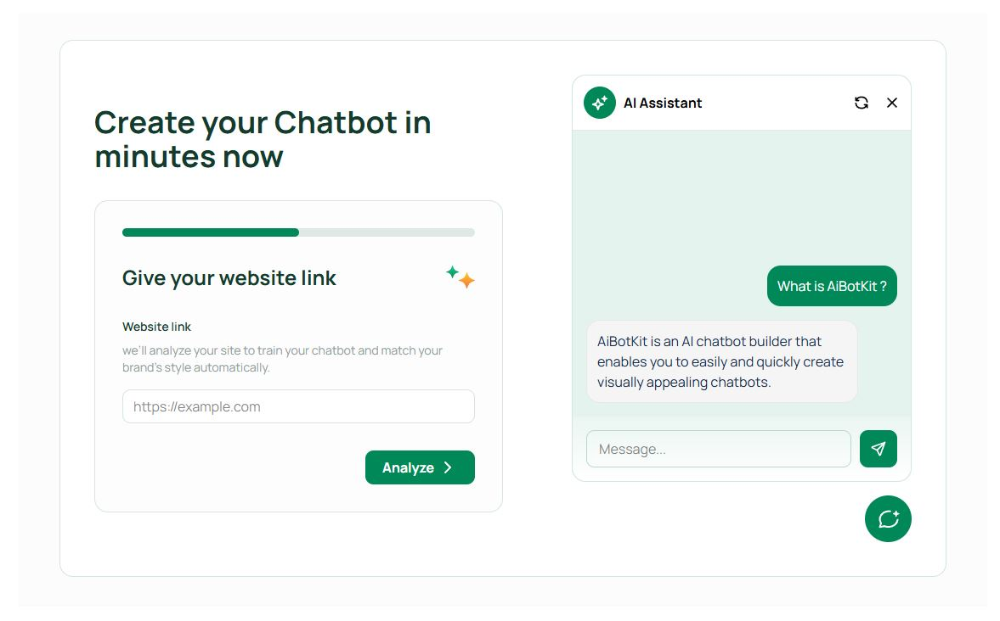<figcaption></figcaption></figure>

***

#### Step 2: Enter Your Website

* Paste your website URL in the analyzer box.
* AI Bot Kit scans your site and suggests themes that match your brand.

<figure>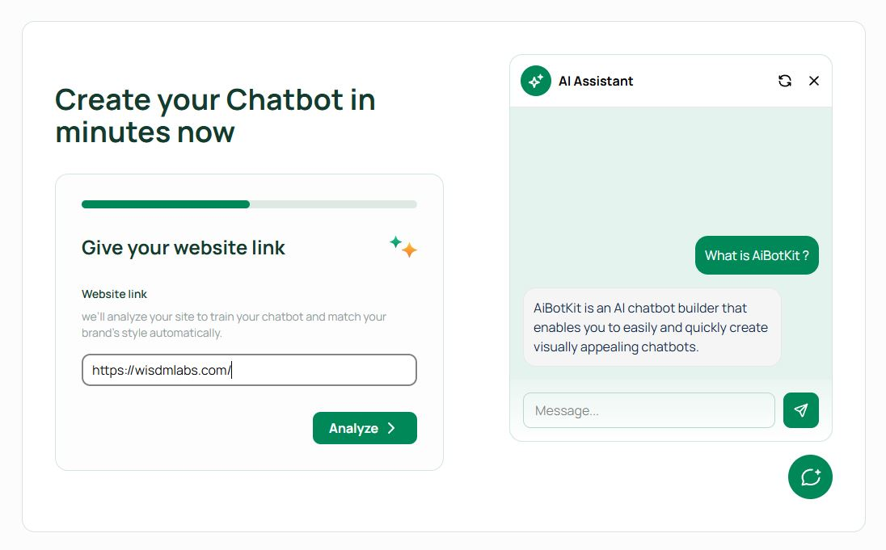<figcaption></figcaption></figure>

***

#### Step 3: Choose a Theme

* Select one of the **4 theme options** generated from your site’s colors and layout.

<figure>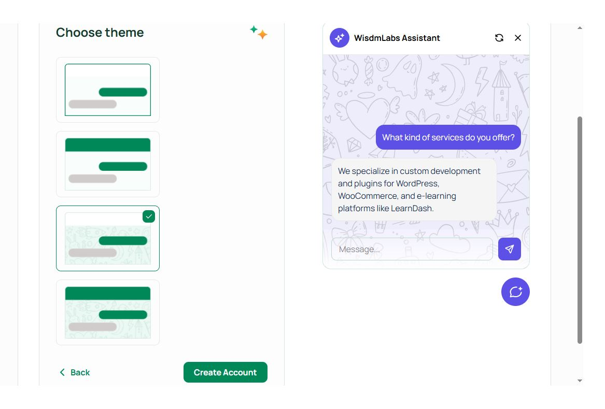<figcaption></figcaption></figure>

***

#### Step 4: Create an Account

* Sign up with your **email and password**.
* Your first chatbot is created instantly in your dashboard.

<figure>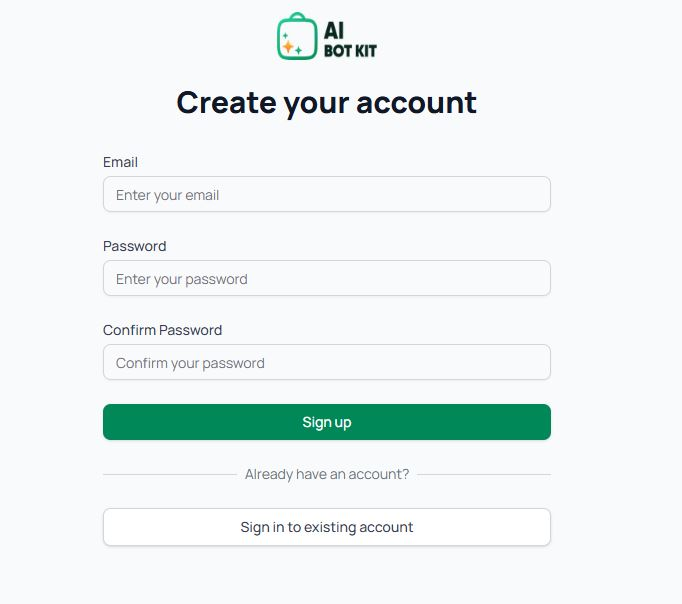<figcaption></figcaption></figure>

***

#### Step 5: Set General Details

* Give your bot a name.
* Choose a **tone**: Professional, Friendly, or Casual.
* Toggle activation when you’re ready to go live.

<figure>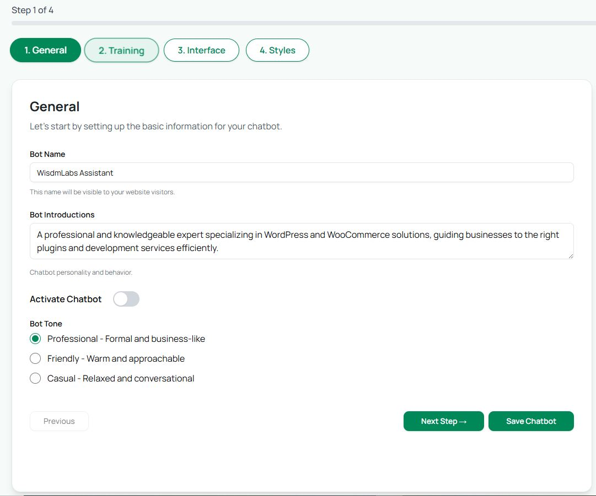<figcaption></figcaption></figure>

***

#### Step 6: Train Your Bot

* Add knowledge from documents (PDFs, Word files), website URLs, or pasted text.
* Your bot learns instantly and can answer based on this content.

<figure>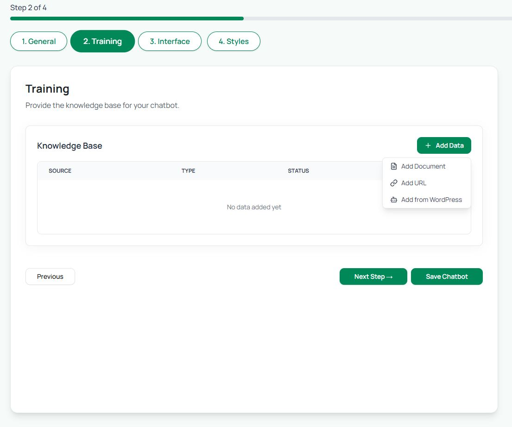<figcaption></figcaption></figure>

***

#### Step 7: Customize Interface

* Edit the **Greeting Message** (first thing users see).
* Set a **Fallback Message** (for when the bot doesn’t understand).

<figure>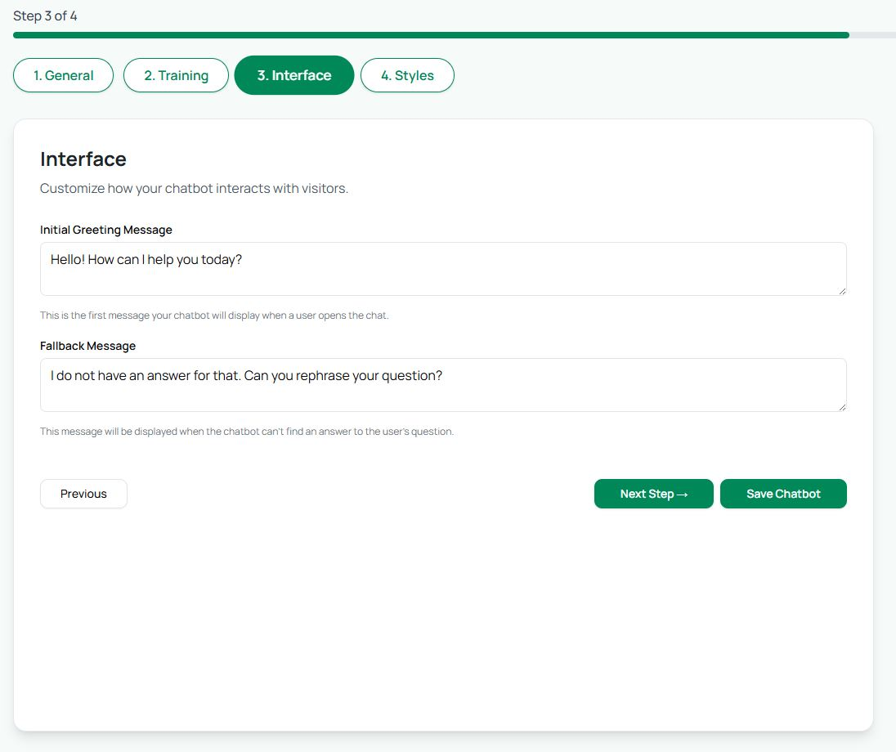<figcaption></figcaption></figure>

***

#### Step 8: Style Your Chatbot

* Choose widget position (bottom-right or bottom-left).
* Pick colors, button style, and bot avatar to match your brand.

<figure>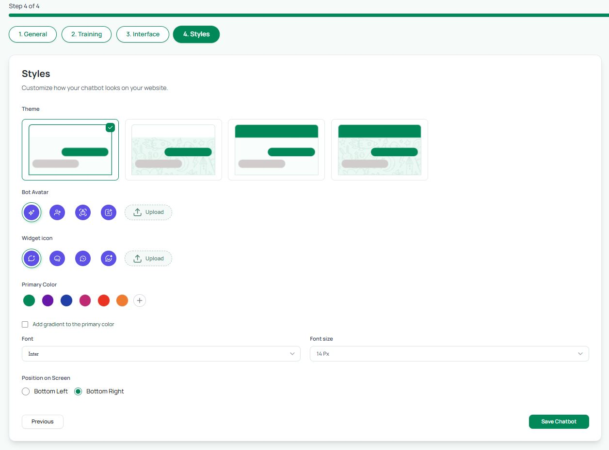<figcaption></figcaption></figure>

***

#### Step 9: Save and Preview

* Click **Save Chatbot** in the dashboard.
* Test your bot in preview mode to ensure everything works.

***

#### Step 10: Get Your Embed Code

* Copy the embed code snippet from **Preview & Launch**.

<figure>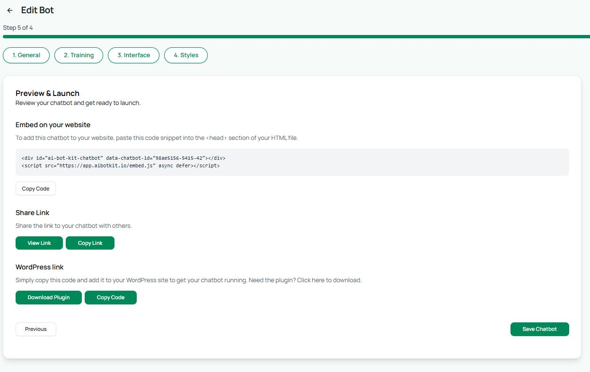<figcaption></figcaption></figure>

***

#### Step 11: Add to Your Website

* Paste the embed code into your website:
  * Squarespace → Embed Block or Code Injection
  * WordPress → Custom HTML block or AI Bot Kit Plugin
  * Other platforms → Paste into header/footer or custom code sections

***

#### Step 12: Verify Installation

* Publish your site.
* Open it in an incognito window and check if the chatbot loads.

***

#### Step 13: Monitor Analytics

* Go to your dashboard → **Analytics** tab.
* Track conversations, messages, characters, and daily active users.

<figure>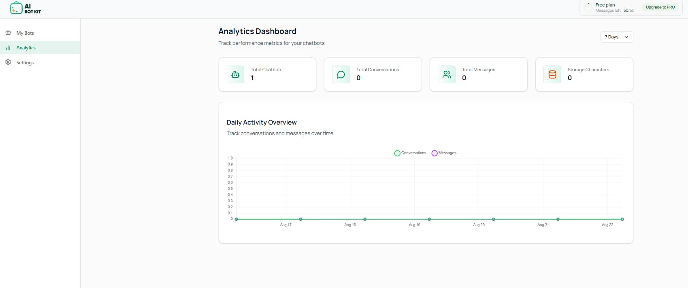<figcaption></figcaption></figure>

***

#### Step 14: Retrain as Needed

* Add new documents, URLs, or FAQs anytime from the Training tab.
* Save → Your bot updates instantly.

***

#### Step 15: Upgrade (Optional)

* If you reach the Free Plan limits (50 messages/month), go to **Plans & Billing**.
* Upgrade to Basic, Essential, or Business for more bots, storage, and messages.

<figure>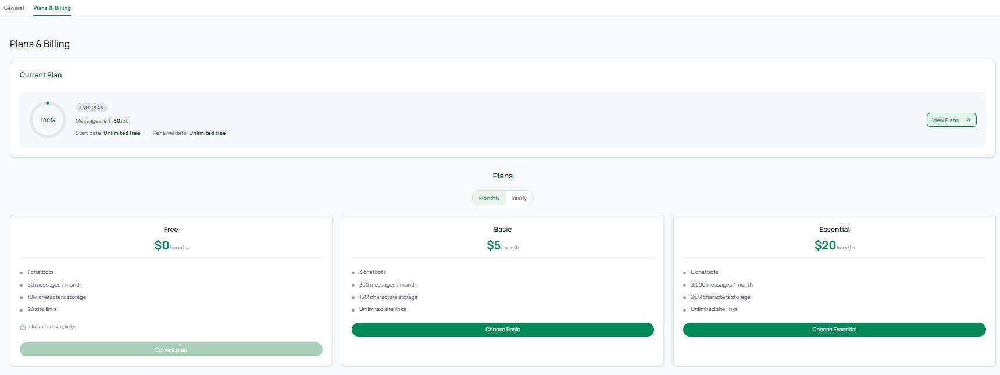<figcaption></figcaption></figure>

***

⚡ **That’s it!**\
Your AI chatbot is now live. You can customize it further anytime, but these 15 steps will take you from zero to a working chatbot in minutes.

👉 For more details, explore the individual tabs in this documentation (Training, Styles, Embedding, Analytics, etc.).
