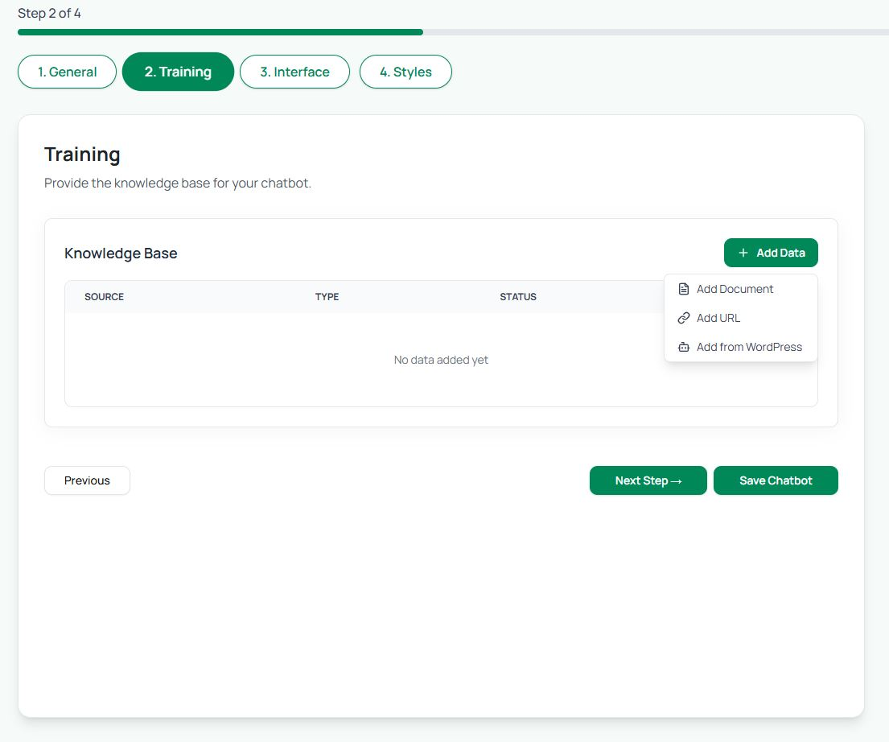

# Step 2: Training

In the **Training** tab, you define what your chatbot actually knows. This is where you add the **knowledge base**.

* Click **Add Data** to upload information. You can:
  * **Add Document** → Upload PDFs, Word files, or text docs
  * **Add URL** → Link pages from your website or knowledge base
  * **Add Text** → Paste content directly (FAQs, policies, guides, etc.)
* Once uploaded, your data will appear in the Knowledge Base list with **Source, Type, and Status**.
* You can add multiple sources — the bot will learn instantly and respond based on this knowledge.

💡 **Tip**: Start with your most common FAQs, product pages, or guides so your bot can handle real customer questions right away.

<figure><figcaption></figcaption></figure>

