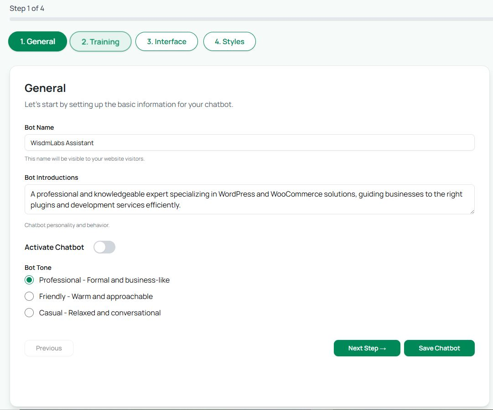

# Step 1: General

The **General** tab is where you set the basic details and personality of your chatbot.

* **Bot Name**: Enter a name that your visitors will see. This helps make your chatbot feel personal and recognizable.
* **Bot Instructions**: Write a short introduction or guidance message to set the right expectations. For example:\
  &#xNAN;_“I’m here to help answer your product questions and guide you through the site.”_
* **Bot Tone**: Choose how your bot should sound:
  * **Professional** → Formal and business-like responses
  * **Friendly** → Warm, approachable, and conversational
  * **Casual** → Relaxed, informal, and engaging
* **Footer Text :** Customize how your footer appears.\
  \- Update the footer message to reflect your industry.\
  \- For example, if you’re a doctor, you could write: _“These are AI-generated responses provided for assistance. Please review important details carefully before relying on them.”_\
  _( Note - this feature is available only in Paid Plans )_

This step sets the **personality** and **voice** of your chatbot, making it feel natural to your audience.

<figure><figcaption></figcaption></figure>
