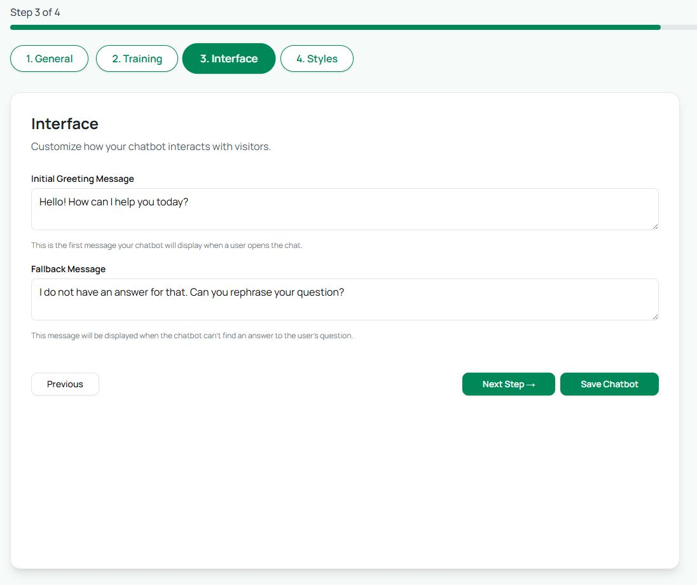

# Step 3: Interface

The **Interface** tab controls how your chatbot communicates with visitors.

* **Greeting Message**: This is the first message shown when someone opens the chatbot. Example:\
  &#xNAN;_“Hello! 👋 How can I help you today?”_
*   Greeting Message Display: Customize where the greeting message should be displayed, we have 3 options : 

    Choose where you want the greeting message to appear. There are three options:

    1. **In Chat Only**\
       The message is shown only inside the chatbot, after it has been opened.
    2. **Above Chat Icon**\
       The message appears above the chatbot icon (before opening the chatbot) and is also visible inside the chatbot.
    3. **Above Chat Icon (Delayed)**\
       The message appears above the chatbot icon after a delay. You can set the delay time (in minutes), and the message will pop up accordingly.

<figure><figcaption></figcaption></figure> <figure><figcaption></figcaption></figure>

* Quick Messages : Add predefined question snippets that users can click on, so they don’t have to type their queries manually.

<figure><figcaption></figcaption></figure>

 

* **Fallback Message**: This appears when the chatbot doesn’t understand a question. Example:\
  &#xNAN;_“I don’t have an answer for that yet. Can you rephrase your question?”_

These settings ensure your bot always responds — even if it doesn’t know the exact answer — and keeps the conversation flowing.

<figure><figcaption></figcaption></figure>

Lead Generation&#x20;

<figure><figcaption></figcaption></figure>

<figure><figcaption></figcaption></figure>

The **Contact Form** allows you to collect user information directly through the chatbot, making it ideal for **lead generation**. You can customize its behavior and appearance as follows:

* **Display Position:** Choose when the form appears:
  * **At Start:** The form is shown immediately when the chatbot opens.
  * **After First Response:** The form is displayed after the chatbot sends its first message.
  * **At End:** The form appears after the conversation ends.
* **Form Heading:** Add a custom heading to guide users, e.g., _“We need your details to help you better.”_
* **Form Fields:** Select the information you want to collect: **Name**, **Email**, and **Phone Number**.
* **Success Messages:**
  * **With Name:** Personalized message that includes the user’s name, e.g., _“Thank you for sharing your details with us. How can we help you, {user\_name}?”_
  * **Without Name:** Message displayed if the user did not provide their name, e.g., _“Thank you for sharing your details with us. How can we help you?”_
* **Consent Message (Optional):** Enable a consent message to inform users before they fill out the form.

This feature ensures you can seamlessly collect leads while maintaining a smooth chatbot experience.

The generated leads will be displayed in chat conversation history as shown below :&#x20;

<figure><figcaption></figcaption></figure>

Follow Up Message :

<figure><figcaption></figcaption></figure>

This pop-up message appears when a user has been inactive for more than 5 minutes. You can fully customize the text to suit your bot’s tone and context.
