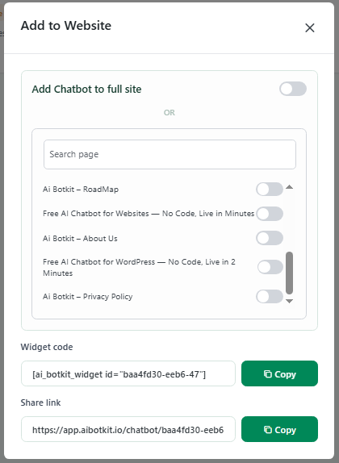

# Step 3: Interface

The **Interface** tab controls how your chatbot communicates with visitors.

<figure><figcaption></figcaption></figure>

**Greeting Message**: This is the first message shown when someone opens the chatbot. Example:\
&#xNAN;_“Hello! 👋 How can I help you today?”_

**Greeting Message Display**: Customize where the greeting message should be displayed, we have 3 options :&#x20;

Choose where you want the greeting message to appear. There are three options:

1. **In Chat Only**\
   The message is shown only inside the chatbot, after it has been opened.
2. **Above Chat Icon**\
   The message appears above the chatbot icon (before opening the chatbot) and is also visible inside the chatbot.
3. **Above Chat Icon (Delayed)**\
   The message appears above the chatbot icon after a delay. You can set the delay time (in minutes), and the message will pop up accordingly.

<figure><figcaption></figcaption></figure> <figure><figcaption></figcaption></figure>

* **Quick Messages** : Add predefined question snippets that users can click on, so they don’t have to type their queries manually.

<figure><figcaption></figcaption></figure>

 

* **Fallback Message**: This appears when the chatbot doesn’t understand a question. Example:\
  &#xNAN;_“I don’t have an answer for that yet. Can you rephrase your question?”_

These settings ensure your bot always responds — even if it doesn’t know the exact answer — and keeps the conversation flowing.

#### Lead Generation&#x20;

<figure><figcaption></figcaption></figure>

<figure><figcaption></figcaption></figure>

The **Contact Form** allows you to collect user information directly through the chatbot, making it ideal for **lead generation**. You can customize its behavior and appearance as follows:

<figure><figcaption></figcaption></figure>

**Display Position:** Choose when the form appears:

* **At Start:** The form is shown immediately when the chatbot opens.
* **After First Response:** The form is displayed after the chatbot sends its first message.
* **At End:** The form appears after the conversation ends.

**Form Heading:** Add a custom heading to guide users, e.g., _“We need your details to help you better.”_

**Form Fields:** Select the information you want to collect: **Name**, **Email**, and **Phone Number**.

<figure><figcaption></figcaption></figure>

**Success Messages:**

* **With Name:** Personalized message that includes the user’s name, e.g., _“Thank you for sharing your details with us. How can we help you, {user\_name}?”_
* **Without Name:** Message displayed if the user did not provide their name, e.g., _“Thank you for sharing your details with us. How can we help you?”_

**Consent Message (Optional):** Enable a consent message to inform users before they fill out the form.

This feature ensures you can seamlessly collect leads while maintaining a smooth chatbot experience.

#### Lead Form Email Notification

<figure><figcaption></figcaption></figure>

If you are on Essential or Business Plan, we have an additional Lead Form Email Notification feature for you. This feature sends you an instant email notification whenever a user fills out your chatbot's contact form. You'll immediately know when someone has provided their contact information, allowing you to follow up quickly.

#### How It Works

1. A user interacts with your chatbot and fills out the contact form (name, email, phone)
2. As soon as they submit the form, you receive an email notification
3. The email includes all the contact details and the conversation history leading up to the form submission
4. You can click a link in the email to view the full conversation in your dashboard

#### Setting Up Contact Form Email Notifications

1. Toggle the feature ON
2. Enter the email address where you want to receive notifications
3. Make sure your contact form is enabled in the chatbot settings

#### What You'll Receive

Each email notification includes:

* **Contact Details**: Name, email, phone number, and consent status
* **Conversation History**: The complete chat conversation that happened before the form was submitted
* **Quick Access**: Direct links to view the conversation in your dashboard

#### Benefits

* Never miss a lead - get notified instantly
* See the full context of how the lead was generated
* Respond faster with all information in one place
* Track which conversations are converting to leads

The generated leads will be displayed in chat conversation history as shown below :&#x20;

<figure><figcaption></figcaption></figure>

Follow Up Message :

<figure><figcaption></figcaption></figure>

This pop-up message appears when a user has been inactive for more than 1 minute. You can fully customize the text to suit your bot’s tone and context.
