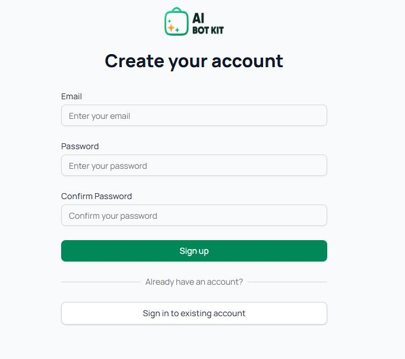

# Create Your Account

After choosing your theme, you’ll be asked to create an account.

* Sign up using your **email and password** (or log in if you already have an account).
* This step connects your selected theme and chatbot setup to your personal dashboard.
* Once done, your chatbot will be generated instantly inside your account.
* From here, you can continue to configure, train, and customize your bot.

<figure><figcaption></figcaption></figure>

