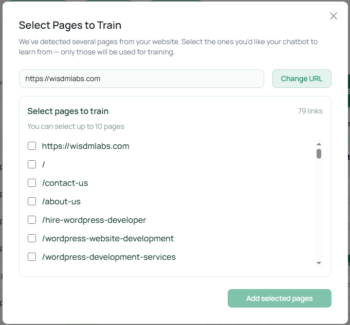

# Step 5 - Customizing

### <mark style="color:blue;">Step 5: Styles & Appearance</mark> 🎨

_Making your chatbot match your brand_

#### **Visual Customization Options:**

**Theme Settings**

<figure><figcaption></figcaption></figure>

Choose the theme that best suits your website.

**🎨 General Settings**

<figure><figcaption></figcaption></figure>

**Bot Avatar:**

* **Upload custom image:** 256x256 pixels recommended
* **File formats:** JPG, PNG, GIF
* **Tips:** Use your logo, mascot, or professional headshot
* **Fallback:** Robot emoji (🤖) if no image uploaded

**Widget Icon**&#x20;

* **What it affects:** The way widget icon is seen on your website
* **Tips** : You can select from the available options or you can upload on your own

**Chat Color:**

* **What it affects:** Chat bubble, send button, user messages
* **How to choose:** Match your website's main color
* **Color picker:** Click to select or enter hex code (#007fff)

**Font Settings:**

* **Font Family:** Inter, Roboto, Open Sans, Lato
* **Font Size:** 12-20 pixels (14px recommended)
* **Tip:** Match your website's typography

***

**🖼️ Header Settings**

<figure><figcaption></figcaption></figure>

**Background Color:**

* **Default:** White (#FFFFFF)
* **Custom:** Match your website header

**Font/Icon Color:**

* **Default:** Black (#000000)
* **Ensure contrast:** Make sure text is readable

***

**💬 Popup ChatBox Settings**

<figure><figcaption></figcaption></figure>

**Dimensions:**

* **Width:** 300-500 pixels (424px default)
* **Max Height:** 400-800 pixels (700px default)
* **Mobile tip:** Smaller widths work better on mobile

***

**🎯 Chat Window Settings**

<figure><figcaption></figcaption></figure>

**Background Colors:**

* **Chat window:** Usually white or light gray
* **AI messages:** Light blue or gray (#007fff1a)
* **User messages:** Your brand color (#007fff)

**Font Colors:**

* **AI message text:** Dark gray (#1C1C1C)
* **User message text:** White or dark (ensure readability)

***

**🔵 Chat Widget Bubble**

<figure><figcaption></figcaption></figure>

**Size Settings:**

* **Height & Width:** 40-80 pixels (55px default)
* **Keep proportional:** Same height and width for perfect circle

**Position:**

* **Bottom Right:** Most common, doesn't interfere with navigation
* **Bottom Left:** Good if you have other widgets on the right

***

#### **🎨 Style Strategy by Brand:**

**Professional/Corporate:**

* **Colors:** Blues, grays, subtle
* **Font:** Roboto or Open Sans
* **Avatar:** Logo or professional headshot
* **Size:** Standard dimensions

**Creative/Fun:**

* **Colors:** Bright, brand-specific
* **Font:** Inter or Lato
* **Avatar:** Mascot or character
* **Size:** Slightly larger for visibility

**Minimalist:**

* **Colors:** Monochrome or single accent
* **Font:** Inter, clean
* **Avatar:** Simple logo or icon
* **Size:** Smaller, unobtrusive

#### **📱 Mobile Optimization Tips:**

* **Test width:** Preview on mobile devices
* **Check colors:** Ensure readability on small screens
* **Position:** Bottom right usually works best
* **Size:** Don't make bubble too large

#### **✅ Step 5 Checklist:**

* [ ] Upload bot avatar (optional but recommended)
* [ ] Set primary color to match your brand
* [ ] Configure font family and size
* [ ] Customize header colors
* [ ] Set chat window dimensions
* [ ] Choose bubble position (bottom right recommended)
* [ ] Test colors for readability and contrast
