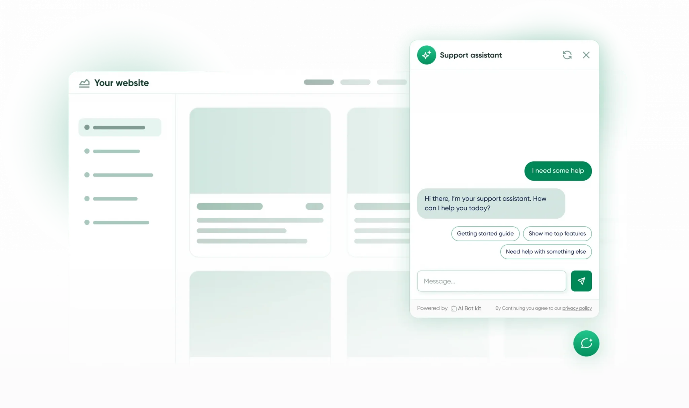

# What is AI Bot Kit?

## <mark style="color:blue;">Introduction</mark> :&#x20;

<figure><figcaption></figcaption></figure>

Imagine having a smart assistant on your website that never sleeps, never gets tired, and always has the right answers for your visitors. That's exactly what AI BotKit brings to your WordPress website!

[AI BotKit](https://aibotkit.io/) is a powerful yet easy-to-use app that adds an intelligent chatbot to your website. But this isn't just any ordinary chatbot - it's powered by advanced artificial intelligence that can actually understand your content and provide meaningful, helpful responses to your visitors.

## <mark style="color:blue;">How Does It Work?</mark>

Think of AI BotKit as a super-smart assistant for your website:

1. **📚 It reads everything on your website** - your blog posts, pages, product descriptions, and any documents you upload
2. **🧠 It understands and remembers** this information using advanced AI technology
3. **💬 When visitors ask questions**, it instantly finds the most relevant information
4. **✨ It provides helpful, accurate answers** in a natural, conversational way

No more visitors leaving because they couldn't find what they were looking for!

## <mark style="color:blue;">Ready to Get Started?</mark>

The best part? You don't need to be tech-savvy to use AI BotKit. Our setup wizard will guide you through everything step-by-step, and you'll have your intelligent assistant up and running in minutes, not hours.

***

_<mark style="background-color:blue;">This is just the beginning! AI BotKit is constantly evolving with new features like voice assistants and agentic AI coming soon. You're not just getting a chatbot - you're investing in the future of website interaction.</mark>_

<figure><figcaption></figcaption></figure>
